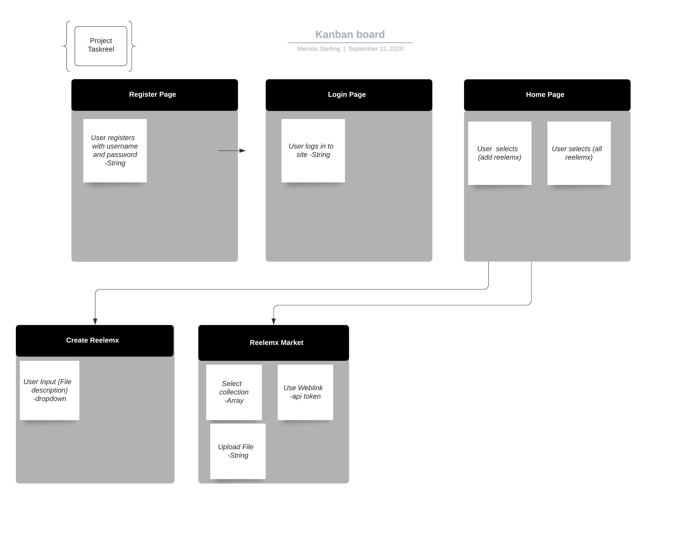
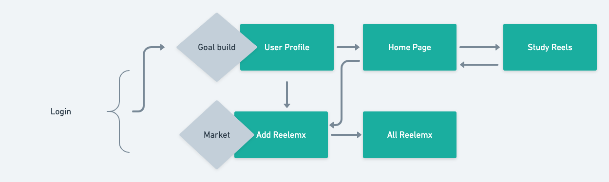

# Project TaskReel

Making learning fun could answer the problem of how do I use my time and develop a new skill. That is what my project seeks to bring with a newer, simpler design using multiple technologies that allow a user to save their study goals, learn a hobby, and use the API giving updates and related subject briefings on their study topics in mind. 

### Technology:

React
Youtube API
PostQL
Python
Flask

ERD: 

Wireframe: 

### Main Features
User can register and using their profile can make new study goals, edit those goals and progress more as they learn all in one setting, preferably my app.

### Challenges:

Getting a functional auth was a concern that became a relief once handled. Also stretch goals were made into smaller pieces so that eventually they will reach production. Those stretch goals include providing a API that does what it should, and adjusting some styling to really promote a better way of learning.